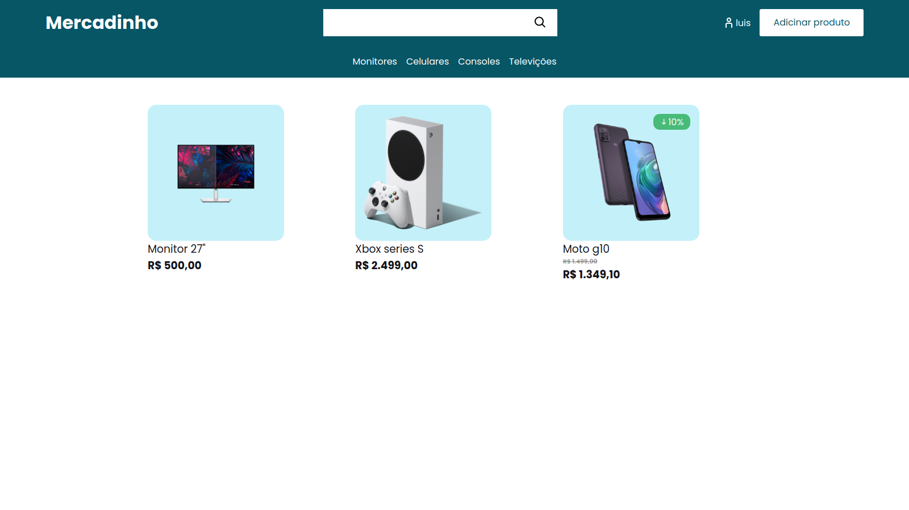

<h1 align="center">Mercadinho do seu Luis</h1>

Ecommerce (Não funcional), criado para aprender mais sobre o framework Django.

<p align="center">
  
  
  
</p>

<h4 align="center"> 
	👨‍💻 Em construção  👨‍💻
</h4>

<p align="center">
 <a href="#Tecnologias">Tecnologias</a> •
 <a href="#Iniciando-projeto">Iniciando projeto</a> •
 <a href="#autor">Autor</a>
</p>





## Tecnologias

Tecnologias usadas:

- Django
- CSS
- HTML


## Iniciando projeto

Clone esse projeto e acesse a pasta.

```bash
$ https://github.com/Luis-Felipe-N/mercadinho_do_seu_luis.git
$ cd mercadinho_do_seu_luis
```

Siga os passos:
```bash
# Instando pacotes
$ pip install -r requirements.txt


# Iniciando máquina virtual - Há outras escolha
$ pip install virtualenv
$ python3 -m virtualenv env
$ source env/bin/activate

# Iniciando django
$ python manage.py runserver
```
The app will be available for access on your browser at http://127.0.0.1:8000/


<p align="center" >Feito com ❤️ por Luis Felipe</p>
